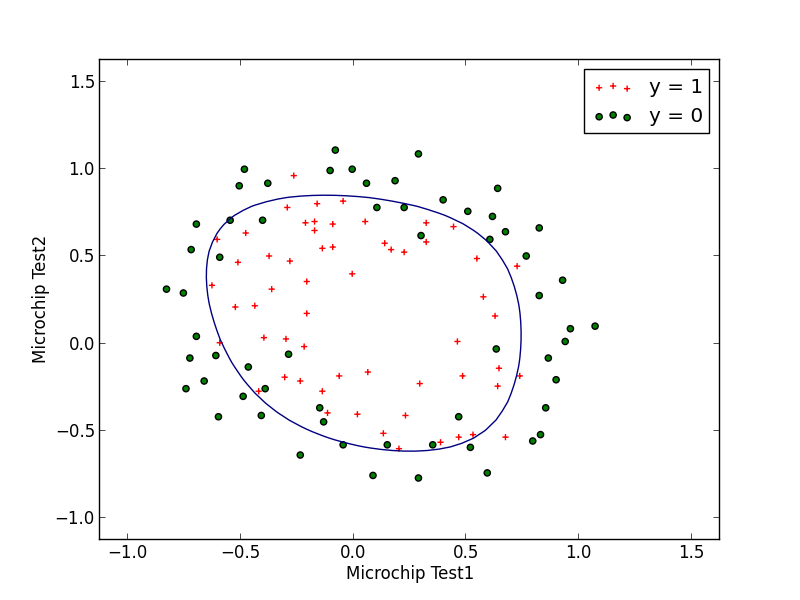

# Maleapy
### Some simple exercises of Machine Learning with python

---

## Exercise0: Basic using of python
> #### Here you can create plots with matplotlib. And there is a practical application which predicts the GMV of Alibaba in double eleven. 

* ### How to use matplotlib

---

## Exercise1: Linear Regression
> #### Implemented linear regression and get to see it work on data in this exercise

* ### Linear regression with one variable
> Implemented linear regression with one variable to predict profits for a food truck in this part of this exercise.

* ### Linear regression with multiple variables
> Implemented linear regression with multiple variables to predict profits for a food truck In this part of this exercise. The following pictuer is a curve of cost function.

---

## Exercise2: Logistic Regression
> #### Implemented logistic regression and apply it to two different datasets in this exercise.

* ### Unregularized Logistic Regression
> This exercise will program logstic regression to build a classification model that estimates an applicant’s probability of admission based the scores from those two exams. 

* ### Regularized Logistic Regression
> This exercise will implement regularized logistic regression to predict whether microchips from a fabrication plant passes quality assurance (QA).  

---

## Exercise3: Multi-class Classification and Neural Networks
> #### Implemented one-vs-all logistic regression and used neural networks whose parameters had been calculated to recognize hand-written digits.

* ### Multi-class Classification
> This part of the exercise extended the previous implemention of logistic regression and applied it to one-vs-all classification on recognizition of handwritten digits.

* ### Neural Networks
> This part of the exercise implemented a neural network to recognize handwritten digits using the same training set as before. The neural network can be able to represent complex models that form non-linear hypotheses. 

The accuracy rate of neural network on training set is :

---

## Exercise4: Neural Networks Learning
> #### Implemented the backpropagation algorithm for neural networks and applied it to the task of hand-written digit recognition.

* ### Regularized cost function
> Implemented and tested the regularized cost function and feedforward propagation.

Selected 100 pictures to predict and showed results dynamicly:

* ### Backpropagation
> Implemented the backpropagation algorithm to compute the gradient for the neural network cost function.
